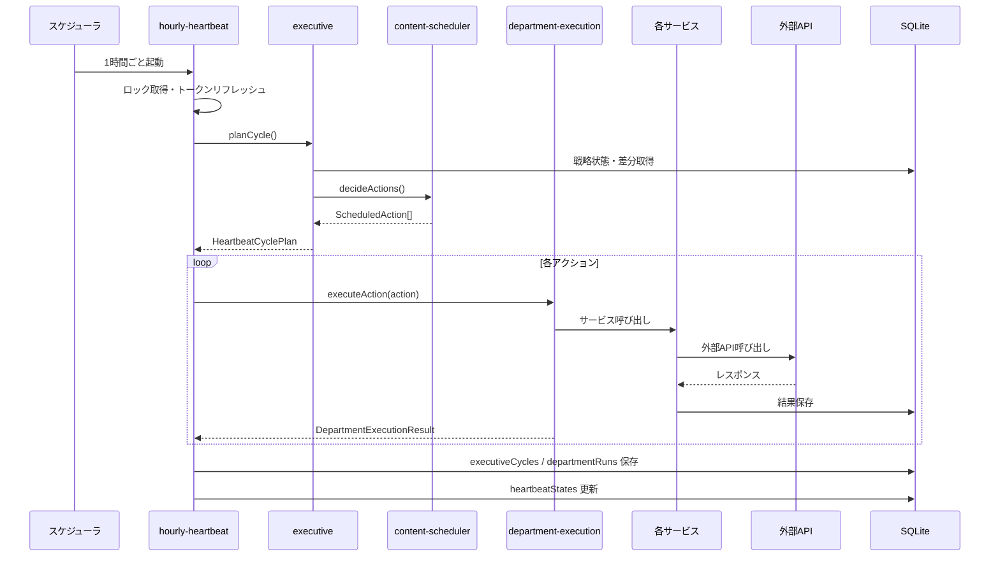
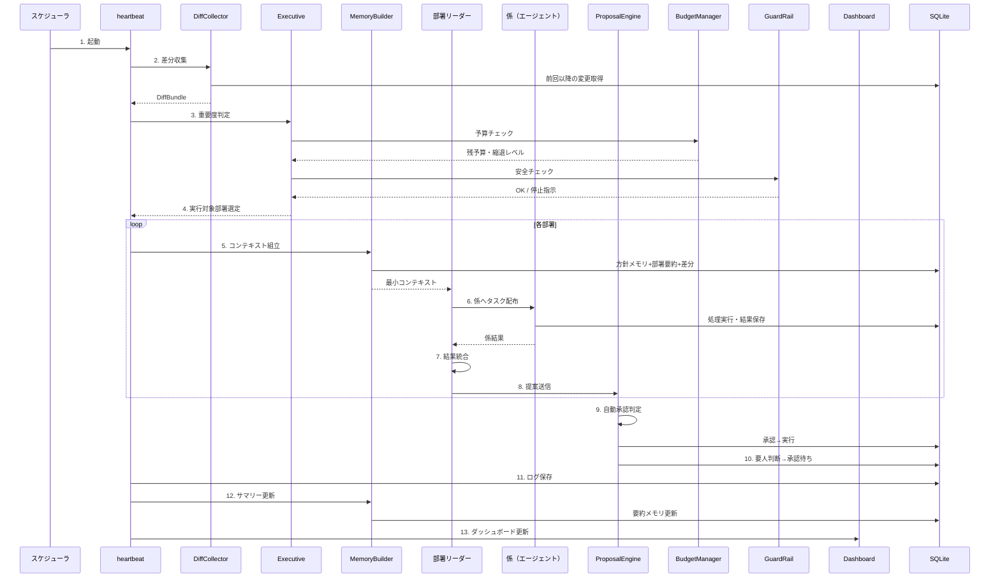
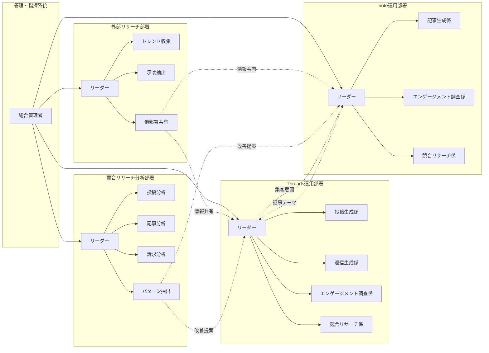

# ThreadsOS アーキテクチャ

> 生成日: 2026-04-08

---

## 1. 現在のアーキテクチャ

### 1.1 全体構成図

```mermaid
graph TB
    subgraph "エントリーポイント"
        HB[hourly-heartbeat.ts]
        DTR[daily-topic-research.ts]
        DTP[daily-threads-plan.ts]
        NNP[nightly-note-pipeline.ts]
        PPF[post-publish-followup.ts]
        WR[weekly-retro.ts]
        LW[llm-heartbeat-worker.ts]
    end

    subgraph "ジョブ基盤"
        RUN[runner.ts<br/>ジョブ実行・ロック・ログ]
    end

    subgraph "サービス層"
        EXEC[executive<br/>戦略判断・サイクル計画]
        DEPT[department-execution<br/>部署別実行]
        ORCH[orchestration<br/>パイプライン統合]
        SCHED[content-scheduler<br/>スケジュール・アクション決定]
        PUB[auto-publisher<br/>投稿・記事公開]
        OPT[cadence-optimizer<br/>頻度最適化]
        NOTIF[notification<br/>通知・進捗レポート]
        REPLY[reply-execution<br/>返信実行]
    end

    subgraph "Threads系サービス"
        PG[post-generation<br/>投稿ドラフト生成]
        PA[post-audit<br/>投稿監査]
        EA[engagement-analysis<br/>反応分析・リプライ分類]
        TS[topic-selection<br/>トピック選定]
    end

    subgraph "note系サービス"
        NG[note-generation<br/>記事生成]
        NA[note-audit<br/>記事監査]
        NEA[note-engagement-analysis<br/>note反応分析]
    end

    subgraph "共通サービス"
        RES[research<br/>リサーチ・競合]
        PROF[profile-context<br/>運用者プロフィール]
    end

    subgraph "アダプタ層"
        TAPI[threads-api<br/>Threads Graph API]
        NAPI[note-api<br/>Playwright + API]
        LLM[llm<br/>Claude Code / API]
        WS[web-search<br/>Jina Reader]
        NR[note-research<br/>noteリサーチ]
        SCR[scraper<br/>HTML scraping]
        STR[storage<br/>ファイルシステム]
        NTF[notifier<br/>File / Discord]
    end

    subgraph "データ層"
        DB[(SQLite<br/>Drizzle ORM<br/>24テーブル)]
        FS[ファイルシステム<br/>docs/notifications<br/>data/]
    end

    HB --> RUN
    DTR --> RUN
    DTP --> RUN
    NNP --> RUN
    PPF --> RUN
    WR --> RUN

    HB --> EXEC --> DEPT
    DEPT --> ORCH
    DEPT --> SCHED
    DEPT --> PUB
    DEPT --> OPT
    DEPT --> NOTIF
    DEPT --> REPLY
    DEPT --> NEA

    ORCH --> PG
    ORCH --> PA
    ORCH --> EA
    ORCH --> TS
    ORCH --> NG
    ORCH --> NA
    ORCH --> RES

    PG --> LLM
    PA --> LLM
    EA --> LLM
    NG --> LLM
    NA --> LLM
    RES --> WS
    RES --> LLM
    OPT --> LLM

    PUB --> TAPI
    PUB --> NAPI
    REPLY --> TAPI
    EA --> TAPI
    NEA --> NAPI

    NOTIF --> NTF
    RES --> SCR
    ORCH --> STR

    EXEC --> DB
    DEPT --> DB
    SCHED --> DB
    PUB --> DB
    OPT --> DB
    PG --> DB
    PA --> DB
    EA --> DB
    NG --> DB
    NA --> DB
    NEA --> DB
    TS --> DB
    RES --> DB
    PROF --> DB

    NTF --> FS
    STR --> FS
```



### 1.2 現在のデータフロー



### 1.3 現在のレイヤー構成

```
src/
├── jobs/           # エントリーポイント（CLIジョブ）
├── services/       # ビジネスロジック（17サービス）
│   ├── executive/           # 戦略判断
│   ├── department-execution/ # 部署実行
│   ├── orchestration/       # パイプライン統合
│   ├── content-scheduler/   # スケジュール
│   ├── auto-publisher/      # 公開
│   ├── cadence-optimizer/   # 頻度最適化
│   ├── notification/        # 通知
│   ├── reply-execution/     # 返信
│   ├── post-generation/     # Threads投稿生成
│   ├── post-audit/          # Threads投稿監査
│   ├── engagement-analysis/ # Threads反応分析
│   ├── topic-selection/     # トピック選定
│   ├── note-generation/     # note記事生成
│   ├── note-audit/          # note記事監査
│   ├── note-engagement-analysis/ # note反応分析
│   ├── research/            # リサーチ
│   └── profile-context/     # プロフィール
├── domain/         # ドメインモデル（Zod schema）
│   ├── threads/    # Topic, PostDraft, PostAudit, PostResult, Reply
│   ├── note/       # NoteIdea, NoteDraft, NoteAudit
│   ├── analytics/  # ImprovementInsight, CompetitorSnapshot
│   ├── review/     # ReplyDecision, ScheduledJobRun, proposal-related flows
│   └── department/ # DepartmentName, HeartbeatObjective, FunnelStage
├── adapters/       # 外部接続（8アダプタ）
│   ├── threads-api/   # Threads Graph API
│   ├── note-api/      # Playwright + note API
│   ├── llm/           # Claude Code / Anthropic API
│   ├── web-search/    # Jina Reader
│   ├── note-research/ # noteリサーチ
│   ├── scraper/       # HTMLスクレイピング
│   ├── storage/       # ファイルシステム
│   └── notifier/      # File / Discord通知
├── db/             # Drizzle ORM（24テーブル）
├── config/         # 環境変数（Zod validated）
├── app/            # ロガー・エラー
├── server/         # Fastify（/health のみ）
├── cli/            # setup / input / note-login CLI
└── utils/          # JSON パーサー等
```

---

## 2. 目標アーキテクチャ

### 2.1 全体構成図

```mermaid
graph TB
    subgraph "エントリーポイント"
        HB[hourly-heartbeat<br/>13ステップ標準フロー]
        DASH[ダッシュボード<br/>Fastify + htmx]
        CLI[CLI<br/>管理コマンド]
    end

    subgraph "管理・指揮系統"
        EXEC[Executive<br/>総合判断・全体最適]
        PROP[ProposalEngine<br/>提案管理・承認フロー]
        BUDGET[BudgetManager<br/>予算管理・縮退制御]
        GUARD[GuardRail<br/>安全装置・自動停止]
    end

    subgraph "コンテキスト管理層"
        MEM_A[永続運用方針メモリ]
        MEM_B[部署別要約メモリ]
        MEM_C[イベントログ層]
        MEM_D[ワーキングメモリビルダー]
        MEM_E[KPIスナップショット]
        DIFF[差分コレクター]
        CACHE[LLMキャッシュ]
    end

    subgraph "外部リサーチ部署"
        ER_LEAD[リーダー]
        ER_TREND[トレンド収集]
        ER_INSIGHT[示唆抽出]
    end

    subgraph "競合リサーチ分析部署"
        CR_LEAD[リーダー]
        CR_POST[投稿分析]
        CR_ARTICLE[記事分析]
        CR_PATTERN[パターン抽出]
    end

    subgraph "Threads運用部署"
        TH_LEAD[リーダー]
        TH_POST[投稿生成係]
        TH_REPLY[返信生成係]
        TH_ENG[エンゲージメント調査係]
        TH_COMP[競合リサーチ係]
    end

    subgraph "note運用部署"
        NT_LEAD[リーダー]
        NT_ARTICLE[記事生成係]
        NT_ENG[エンゲージメント調査係]
        NT_COMP[競合リサーチ係]
    end

    subgraph "アダプタ層"
        TAPI[Threads API]
        NAPI[note API<br/>Playwright]
        LLM[LLM<br/>軽量/高精度切替]
        WS[Web検索]
        SCR[スクレイパー]
        STR[ストレージ]
        NTF[通知<br/>File/Discord]
    end

    subgraph "データ層"
        DB[(SQLite<br/>30+テーブル)]
        FS[ファイルシステム]
    end

    subgraph "ダッシュボード"
        API_ROUTES[Fastify API<br/>13+ルート]
        UI[htmx UI<br/>6ページ]
    end

    HB --> DIFF
    DIFF --> EXEC
    EXEC --> PROP
    EXEC --> BUDGET
    EXEC --> GUARD

    EXEC --> ER_LEAD
    EXEC --> CR_LEAD
    EXEC --> TH_LEAD
    EXEC --> NT_LEAD

    ER_LEAD --> ER_TREND
    ER_LEAD --> ER_INSIGHT
    CR_LEAD --> CR_POST
    CR_LEAD --> CR_ARTICLE
    CR_LEAD --> CR_PATTERN

    TH_LEAD --> TH_POST
    TH_LEAD --> TH_REPLY
    TH_LEAD --> TH_ENG
    TH_LEAD --> TH_COMP

    NT_LEAD --> NT_ARTICLE
    NT_LEAD --> NT_ENG
    NT_LEAD --> NT_COMP

    MEM_D --> ER_LEAD
    MEM_D --> CR_LEAD
    MEM_D --> TH_LEAD
    MEM_D --> NT_LEAD

    MEM_A --> MEM_D
    MEM_B --> MEM_D
    DIFF --> MEM_D
    MEM_E --> MEM_D

    TH_POST --> LLM
    TH_REPLY --> LLM
    NT_ARTICLE --> LLM
    ER_TREND --> WS
    CR_POST --> SCR

    TH_POST --> TAPI
    TH_REPLY --> TAPI
    NT_ARTICLE --> NAPI

    PROP --> DB
    BUDGET --> DB
    MEM_B --> DB
    MEM_C --> DB
    MEM_E --> DB

    DASH --> API_ROUTES
    API_ROUTES --> DB
    API_ROUTES --> UI
```



### 2.2 目標データフロー



### 2.3 目標レイヤー構成

```
src/
├── jobs/               # エントリーポイント
│   └── hourly-heartbeat.ts  # 13ステップ標準フロー
├── core/               # 【新設】コア制御
│   ├── executive/           # 管理・指揮系統
│   ├── proposal-engine/     # 提案管理・承認フロー
│   ├── budget-manager/      # 予算管理・縮退制御
│   ├── guard-rail/          # 安全装置・自動停止
│   └── diff-collector/      # 差分収集
├── memory/             # 【新設】メモリ階層
│   ├── policy-memory/       # A. 永続運用方針
│   ├── department-summary/  # B. 部署別要約
│   ├── event-log/           # C. イベントログ索引
│   ├── working-memory/      # D. ワーキングメモリビルダー
│   ├── kpi-snapshot/        # E. KPIスナップショット
│   └── cache/               # LLMキャッシュ
├── departments/        # 【新設】部署層（5部署+係）
│   ├── command/             # 管理・指揮系統
│   ├── external-research/   # 外部リサーチ部署
│   ├── competitor-analysis/ # 競合リサーチ分析部署
│   ├── threads-ops/         # Threads運用部署
│   │   ├── leader.ts
│   │   ├── post-generation-agent.ts
│   │   ├── reply-agent.ts
│   │   ├── engagement-agent.ts
│   │   └── competitor-agent.ts
│   └── note-ops/            # note運用部署
│       ├── leader.ts
│       ├── article-agent.ts
│       ├── engagement-agent.ts
│       └── competitor-agent.ts
├── services/           # ビジネスロジック（既存維持）
├── domain/             # ドメインモデル（拡張）
├── adapters/           # 外部接続（既存維持）
├── db/                 # Drizzle ORM（テーブル追加）
├── server/             # 【拡張】Fastify API + htmx
│   ├── routes/              # APIルート
│   ├── views/               # htmxテンプレート
│   └── static/              # CSS/JS
├── config/             # 環境変数
├── app/                # ロガー・エラー
├── cli/                # 管理CLI
└── utils/              # ユーティリティ
```

---

## 3. 部署構成の詳細



---

## 4. データベーステーブル構成

### 4.1 現在のテーブル（24テーブル）

| カテゴリ | テーブル | 用途 |
|----------|---------|------|
| Threads | topics | トピック管理 |
| Threads | research_items | リサーチデータ |
| Threads | thread_post_drafts | 投稿ドラフト |
| Threads | thread_post_audits | 投稿監査結果 |
| Threads | thread_post_results | 投稿実績 |
| Threads | thread_replies | リプライ |
| Threads | reply_decisions | 返信判定 |
| note | note_ideas | 記事アイデア |
| note | note_drafts | 記事ドラフト |
| note | note_audits | 記事監査結果 |
| note | note_post_results | 記事実績 |
| note | thumbnail_tasks | サムネイルタスク |
| 分析 | improvement_insights | 改善示唆 |
| 分析 | competitor_snapshots | 競合スナップショット |
| 分析 | channel_performance_snapshots | パフォーマンス集計 |
| 運用 | operator_profiles | 運用者プロフィール |
| 運用 | human_inputs | 人間入力 |
| 運用 | content_slots | コンテンツスケジュール |
| 運用 | optimization_decisions | 最適化判断 |
| 運用 | strategy_states | 戦略状態 |
| 運用 | executive_cycles | エグゼクティブサイクル |
| 運用 | department_runs | 部署実行ログ |
| 運用 | proposals | 提案と承認フロー |
| 基盤 | heartbeat_states | ハートビート状態 |
| 基盤 | scheduled_job_runs | ジョブ実行ログ |
| 基盤 | outbound_notifications | 送信通知 |
| 基盤 | llm_task_queue | LLMタスクキュー |

### 4.2 追加予定テーブル（Phase A-B）

| テーブル | 用途 |
|---------|------|
| proposals | 提案管理（title, department, agent, content, reason, evidence, expected_effect, risk, priority, status） |
| agent_states | エージェント状態（department, role, current_task, status） |
| budget_tracking | 予算追跡（agent_id, period, token_used, api_calls, cost_estimate） |
| error_logs | エラー専用ログ（job_name, error_type, message, stack） |
| memory_summaries | 要約メモリ（scope, period_type, summary, raw_ref_ids） |

---

## 5. 技術スタック

| レイヤー | 技術 |
|----------|------|
| 言語 | TypeScript (ESM) |
| ランタイム | Node.js |
| パッケージ管理 | pnpm |
| DB | SQLite + Drizzle ORM |
| APIサーバー | Fastify |
| ダッシュボードUI | htmx + 軽量CSS |
| LLM | Claude Code (heartbeat) / Anthropic API (direct) |
| ブラウザ自動化 | Playwright (note投稿) |
| 外部検索 | Jina Reader |
| SNS API | Threads Graph API |
| 通知 | Discord Webhook / ファイル通知 |
| バリデーション | Zod |
| ロガー | Pino |
| テスト | Vitest |
